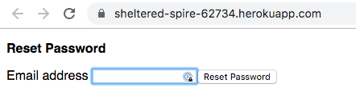
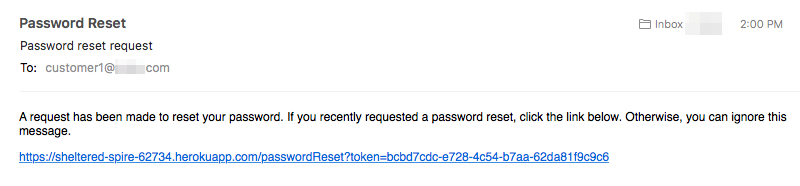
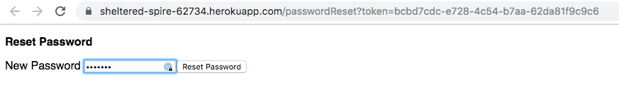
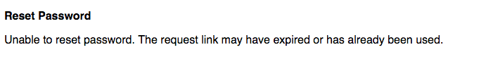
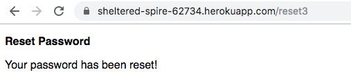

# Password reset example

This example shows how to implement email-based password reset for Particle simple auth products. This is not needed for:

- Developer accounts, which can reset passwords through the Particle login page
- Two-legged auth customers, which don't typically use passwords

This example is intended to show how the process will work. While you can deploy it exactly as is, you'll probably either want to integrate it into your own server, or at least add some branding. It's quite minimal to make it easier to understand.

The process works like this:

- If your customer forgets their password, they can go to the reset site where there's a box to enter their email address. In the example below, it would be:

https://sheltered-spire-62734.herokuapp.com/

(Don't actually try to go there, that site was created during the exercise below then disabled. But if you deployed a site like one below, you'd go to the top level page.



- Or if you have a mobile app or other web site, you could redirect to the reset1 page with an email parameter. This is handy if you already know their email/account identifier.

https://sheltered-spire-62734.herokuapp.com/reset1?email=customer1%40company.com

- This page generates a one-time-use token and sends a link including that token to the email address specified. The email address is *not* checked against a list of valid accounts, because that would allow a hacker to probe for email addresses that have accounts by noticing a different response when attempting to reset a password. In this server, the response is exactly the same.

- A page is displayed to check their email.


- When the user receives the email, we know they have access to the email account associated with the Particle customer account, so the password can be reset. There's a link in the email to do this.



- The link brings up a page to allow the new password to be entered. 
xre


- If the link is invalid, expired, or reused, an error is displayed.



- The server now knows the user is able to read email for that account (because they got the secret token) and issues a password set command using the Particle cloud API. If all goes well, a success page is displayed.




## Setting up Heroku

This example uses a small server based on [Heroku](https://heroku.com). It's possible to host this on other cloud providers or even locally, if you want. 

The server itself is written in node.js and expressjs.

- Set up the Heroku prerequisites. The [instructions can be found here](https://devcenter.heroku.com/articles/getting-started-with-nodejs#set-up).

- Clone repo

```
$ git clone https://github.com/particle-iot/password-reset-example.git
$ cd password-reset-example
```

- Create a Heroku app

```
$ heroku create
Creating app... done, sheltered-spire-62734
https://sheltered-spire-62734.herokuapp.com/ | https://git.heroku.com/sheltered-spire-62734.git
```

- Make sure Heroku is connected to git. Note the two heroku entries in addition to the origin entries.

```
$ git remote -v
heroku	https://git.heroku.com/sheltered-spire-62734.git (fetch)
heroku	https://git.heroku.com/sheltered-spire-62734.git (push)
origin	https://github.com/particle-iot/password-reset-example.git (fetch)
origin	https://github.com/particle-iot/password-reset-example.git (push)
```

If not, do this. But it should be connected. Of course your remote names will be different.

```
heroku git:remote -a sheltered-spire-62734
```

### Setting up PostgreSQL

This app uses Heroku PostgreSQL database to store the password reset tokens and also to log requests. You should follow the instructions to [set up PostgreSQL locally](https://devcenter.heroku.com/articles/heroku-postgresql#local-setup). Even if you are only planning on deploying remotely and not testing locally, the local PostgreSQL installation includes the tools to remotely manage the cloud version of PostgreSQL from the command line.

- [Add PostgreSQL to your Heroku app](https://devcenter.heroku.com/articles/getting-started-with-nodejs#provision-a-database)

```
$ heroku addons:create heroku-postgresql:hobby-dev
Creating heroku-postgresql:hobby-dev on sheltered-spire-62734... free
Database has been created and is available
 ! This database is empty. If upgrading, you can transfer
 ! data from another database with pg:copy
Created postgresql-symmetrical-70469 as DATABASE_URL
Use heroku addons:docs heroku-postgresql to view documentation
```

- Create tables

To create tables locally on your own computer's PostgreSQL database:

```
$ psql -h localhost

CREATE DATABASE passreset;

\c passreset
CREATE TABLE tokens (email text UNIQUE NOT NULL, token text, expires timestamp);

CREATE INDEX tokens_token_index ON tokens (token);
CREATE INDEX tokens_expires_index ON tokens (expires);

CREATE TABLE logs (id SERIAL PRIMARY KEY, kind integer, remoteAddr text, email text, msg text, ts timestamp);
CREATE INDEX logs_ts_index ON logs (ts);
```

Or on the cloud database:

```
$ heroku pg:psql
CREATE TABLE tokens (email text UNIQUE NOT NULL, token text, expires timestamp);

CREATE INDEX tokens_token_index ON tokens (token);
CREATE INDEX tokens_expires_index ON tokens (expires);

CREATE TABLE logs (id SERIAL PRIMARY KEY, kind integer, remoteAddr text, email text, msg text, ts timestamp);
CREATE INDEX logs_ts_index ON logs (ts);
```

### Set environment variables

Local testing:

```
export PARTICLE_ACCESS_TOKEN=0e7818e3fe88ef4dc053832b91f02cf3f8442cc3
export PARTICLE_PRODUCT_ID=1319
export SMTP_SERVER=smtp.gmail.com
export SMTP_SECURE=true
export SMTP_PORT=465
export SMTP_USERNAME=password-reset@company.com
export SMTP_PASSWORD=secret
export EMAIL_FROM='"Password Reset" <password-reset@company.com>'
export WEB_URL=http://localhost:5000/
export DATABASE_URL=postgres://localhost:5432/passreset
```

Cloud hosted:

```
heroku config:set PARTICLE_ACCESS_TOKEN=0e7818e3fe88ef4dc053832b91f02cf3f8442cc3
heroku config:set PARTICLE_PRODUCT_ID=1319
heroku config:set SMTP_SERVER=smtp.gmail.com
heroku config:set SMTP_SECURE=true
heroku config:set SMTP_PORT=465
heroku config:set SMTP_USERNAME=password-reset@company.com
heroku config:set SMTP_PASSWORD=secret
heroku config:set EMAIL_FROM='"Password Reset" <password-reset@company.com>'
heroku config:set WEB_URL=https://sheltered-spire-62734.herokuapp.com/
```


A bit more about each of these variables:

- `PARTICLE_ACCESS_TOKEN` is a product bearer token. You probably also want to make it non-expiring. The best way is to go into your product, then Authentication. If you don't already have a Two-Legged Auth (Server) with full control client, create one. In my example, it's `tempmon06-3459`. Note the super secret key you get back, mine is `20fbbf6791211351eec6e7a438ec0ecc69244936`. Never share this key or check it into source control! (That's not a real key, by the way.)

```
curl https://api.particle.io/oauth/token -u "tempmon06-3459:20fbbf6791211351eec6e7a438ec0ecc69244936" -d grant_type=client_credentials -d expires_in=0
```

The PARTICLE_ACCESS_TOKEN is what you get back from the curl call - the product bearer token - not the super secret key!

- `PARTICLE_PRODUCT_ID` is the product ID of your product.

- `SMTP_SERVER` is the server to send mail through. In this example, it's gmail.

- `SMTP_SECURE` should be `true` or `false`. When using gmail, it's true.

- `SMTP_PORT` should be 465 if `SMTP_SECURE=true`. Otherwise, it's probably 25.

- `SMTP_USERNAME` is the username to log into your SMTP server with.

- `SMTP_PASSWORD` is the email password. For Google account with two-factor authentication, this is an app specific password, not your actual Google password!

- `EMAIL_FROM` is the from address to use for the sent email.

- `WEB_URL` is the URL for the web server. Note that it must end with a '/'. The example shows the common format for Heroku TLS-secured pages (https).

- `DATABASE_URL` is only set for local testing. It's automatically set for you in the cloud.

- `PORT` is used for local testing if you want to use a port other than 5000.

### Deploying remotely


- Deploy

```
$ git push heroku master
```

- Scale to one server.

```
$ heroku ps:scale web=1
```

- Open the site in a browser window.

```
$ heroku open
```

- Check logs

```
$ heroku logs --tail
```

### Testing locally

For development, you'll probably want to test locally. Make sure you've set the environment variables, above.

```
heroku local web
```

The default is to use the site http://localhost:5000 but you can use a different port by setting the PORT environment variable.

### Logs database

In addition to logging to the console.log output, a more permanent and less verbose log is kept in the PostgreSQL database. You can view it using the pg:psql command:

```
$ heroku pg:psql
sheltered-spire-62734::DATABASE=> select * from logs;
 id | kind |      remoteaddr      |        email        |      msg       |           ts            
----+------+----------------------+---------------------+----------------+-------------------------
  3 |    1 | 99.92.248.215        | customer1@abcde.com | email accepted | 2019-09-20 15:50:57.665
  4 |    3 | 99.92.248.215        | customer1@abcde.com | success        | 2019-09-20 15:51:23.147
```

### Customizing

The pages are easily customizable. 

- There's a css stylesheet in public/style.css
- The pages and email are formatted in [pug](https://pugjs.org/api/getting-started.html) (formerly known as jade).

The pug templates are in the views directory.

- `layout.pug` contains the base page layout and is extended by all of the web pages.
- `index.pug` is the top level page where the user can enter their email.
- `checkEmail.pug` is the page after submitting their email (either from the top level page or using a directly.
- `enterPassword.pug` is the page after they've clicked the email link and the token is valid. This page has the box to enter a new password. If the token is not valid, then an error message is displayed using showStatus.pug. 
- `showStatus.pug` is the generic status page. It's used after successfully or unsuccessfully updating the password.
- `emailHtml.pug` is the format for the email (in HTML)
- `emailText.pug` is the format for the email (in text). Make sure you only use pug p (paragraph) elements in this page!


